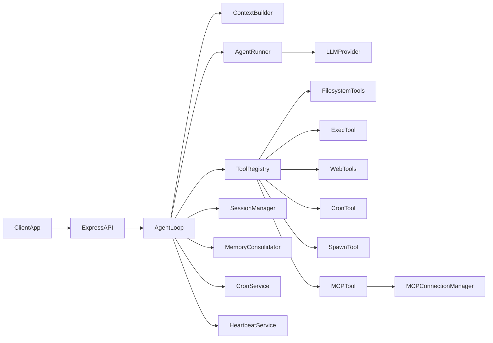

# FomoAgent Technical Guide

`fomoagent` is an API-first agent runtime (JavaScript/Node.js) inspired by `nanobot`, focused on tool-calling workflows without channel adapters (Telegram/Slack/Discord).

## What This Agent Can Do

- Run LLM-driven multi-step tool loops with retries and streaming.
- Persist sessions to disk and maintain long-term memory (`MEMORY.md`, `HISTORY.md`) with automatic consolidation.
- Load skills from workspace `skills/*/SKILL.md` and inject them into system context.
- Execute file tools, shell commands, web search/fetch, scheduling, background spawning, and MCP tool calls.
- Run recurring jobs via a persistent cron service (`cron/jobs.json`).
- Run proactive periodic heartbeat checks from `HEARTBEAT.md`.
- Support provider routing across OpenAI-compatible backends, Anthropic, and Azure OpenAI.
- Expose API endpoints for chat, status, run lifecycle, cron operations, and heartbeat inspection.

## What It Does Not Include

- No channel framework (no Telegram/Slack/Discord adapters).
- No outbound channel manager/retry bus abstraction.
- MCP stdio transport is not fully implemented yet (HTTP MCP call path is present).

## High-Level Architecture



## End-to-End User Flow

1. Client sends a request to `POST /v1/chat` (or `/v1/chat/stream`).
2. API forwards the request to `AgentLoop.process()`.
3. `AgentLoop` loads session history, runtime context, memory, bootstrap docs, and skill summaries.
4. `AgentRunner` calls the selected provider with tool schemas.
5. If model asks for tools, `ToolRegistry` executes tool calls and feeds tool results back to the model.
6. Loop repeats until final answer or stop condition (`completed`, `max_iterations`, `cancelled`, `error`).
7. Turn is persisted to session JSONL; memory consolidation may run in background.
8. Response is returned to API client; streaming mode emits deltas and progress events.

## How To Connect and Run

### 1) Install

```bash
cd fomoagent
npm install
```

### 2) Configure

- Default config path: `~/.fomoagent/config.json`
- Override config path with: `FOMOAGENT_CONFIG_PATH=/absolute/path/config.json`
- Set provider keys via config or environment (e.g. `ANTHROPIC_API_KEY`, `OPENAI_API_KEY`, `OPENROUTER_API_KEY`, `AZURE_OPENAI_API_KEY`).

### 3) Start server

```bash
npm run dev
# or
npm start
```

Server binds to `gateway.host` + `gateway.port` from config.

### 4) Send a request

```bash
curl -X POST http://localhost:18790/v1/chat \
  -H "Content-Type: application/json" \
  -d '{"sessionId":"api:demo","message":"Find Web3 events next month"}'
```

### 5) Streaming request

```bash
curl -N -X POST http://localhost:18790/v1/chat/stream \
  -H "Content-Type: application/json" \
  -d '{"sessionId":"api:demo","message":"Research top Solana hackathons"}'
```

## API Surface

- `GET /health` - service health.
- `GET /v1/status?session=...` - runtime/session status snapshot.
- `GET /v1/sessions` - list persisted sessions.
- `POST /v1/sessions/new` - reset/archive a session.
- `POST /v1/chat` - standard chat completion.
- `POST /v1/chat/stream` - SSE streaming completion.
- `GET /v1/runs` - list background runs.
- `POST /v1/runs/cancel` - cancel active run by `runId`.
- `GET /v1/cron/jobs` - list cron jobs.
- `POST /v1/cron/jobs/:id/run` - execute a cron job immediately.
- `POST /v1/cron/jobs/:id/enable` - enable a cron job.
- `POST /v1/cron/jobs/:id/disable` - disable a cron job.
- `GET /v1/heartbeat/status` - heartbeat decisions/recent runs.

## Config Model (Important Sections)

- `agents.defaults`: model defaults, temperature, iteration limit, run timeout, timezone.
- `providers.*`: provider credentials/endpoints (anthropic, openai, openrouter, azure, etc.).
- `gateway`: API bind host/port.
- `runtime`: concurrency cap (`maxConcurrentRuns`).
- `tools`: web + exec behavior, workspace restriction.
- `scheduler`: cron service behavior and persistence limits.
- `heartbeat`: periodic proactive execution policy.
- `mcp`: MCP bridge enablement, timeout, server definitions.
- `retries`: provider retry delays in milliseconds.

## Runtime Data Written By Agent

Under configured workspace:

- `memory/MEMORY.md` - long-term summary memory.
- `memory/HISTORY.md` - append-only historical events.
- `sessions/*.jsonl` - session message logs + metadata.
- `cron/jobs.json` - persisted recurring job definitions/history.
- `skills/*/SKILL.md` - user/workspace custom skill instructions.
- `HEARTBEAT.md` - source for proactive periodic checks.

## Folder-by-Folder + File-by-File One-Liners

### Root (`fomoagent/`)

- `README.md` - short project README with endpoints, config notes, and parity summary.
- `package.json` - Node package metadata, scripts, and dependencies.
- `package-lock.json` - exact dependency lockfile for reproducible installs.

### `src/`

- `src/index.js` - bootstrap entrypoint that loads config, builds services, initializes `AgentLoop`, and starts Express API.

### `src/api/`

- `src/api/server.js` - Express route definitions for chat, streaming, status, sessions, runs, cron, and heartbeat.

### `src/agent/`

- `src/agent/context.js` - system prompt/context assembly using bootstrap files, memory, skills, and runtime metadata.
- `src/agent/loop.js` - main orchestration layer for request processing, tool registration, persistence, cancellation, and background runs.
- `src/agent/runner.js` - iterative LLM/tool execution loop with streaming and stop-reason handling.
- `src/agent/memory.js` - memory store + token-aware consolidation logic and archival fallback behavior.
- `src/agent/skills.js` - workspace skills discovery, frontmatter parsing, and skill summary rendering.

### `src/config/`

- `src/config/schema.js` - default configuration object and provider spec catalog.
- `src/config/loader.js` - config file loading/merging, env interpolation/hydration, provider matching, and validation.

### `src/providers/`

- `src/providers/base.js` - provider abstraction types and retry wrappers.
- `src/providers/openai-compatible.js` - OpenAI SDK based provider for OpenAI-compatible APIs with tool-call support.
- `src/providers/anthropic.js` - Anthropic adapter with tool-use mapping.
- `src/providers/azure-openai.js` - Azure OpenAI adapter on top of OpenAI-compatible provider flow.
- `src/providers/registry.js` - provider factory/routing that selects the proper adapter from config/model hints.

### `src/tools/`

- `src/tools/base.js` - base `Tool` contract and schema conversion helper.
- `src/tools/registry.js` - runtime tool registry with execution and standardized error hinting.
- `src/tools/filesystem.js` - read/write/edit/list directory tools with optional workspace boundary enforcement.
- `src/tools/shell.js` - guarded shell execution tool with deny-pattern and timeout controls.
- `src/tools/web.js` - web search and URL fetch/extract tools with SSRF checks and untrusted content labeling.
- `src/tools/message.js` - message callback tool for intermediate status delivery.
- `src/tools/cron.js` - tool interface for creating/listing/enabling/disabling/running cron jobs.
- `src/tools/spawn.js` - tool interface for launching/listing independent background runs.
- `src/tools/mcp.js` - tool interface for listing MCP servers/tools and invoking MCP tools.

### `src/cron/`

- `src/cron/store.js` - JSON persistence for cron jobs.
- `src/cron/service.js` - recurring job scheduler, execution lifecycle, and run history tracking.

### `src/heartbeat/`

- `src/heartbeat/service.js` - periodic proactive runner driven by `HEARTBEAT.md` with rate limiting and run logs.

### `src/mcp/`

- `src/mcp/connect.js` - MCP connection manager for server/tool discovery and HTTP-based tool call execution.

### `src/security/`

- `src/security/network.js` - URL/IP safety checks used for SSRF prevention and internal URL blocking.

### `src/session/`

- `src/session/manager.js` - session object model and JSONL persistence/recovery utilities.

### `src/utils/`

- `src/utils/helpers.js` - generic helpers for directories, token estimation, message shaping, and text cleanup.

### `test/`

- `test/config.test.js` - validates config schema and config validation failures.
- `test/cron.test.js` - validates cron service lifecycle basics (create/list/disable + persistence path).

## Capability Mapping (Nanobot-style, No Channels)

- `Core loop parity`: implemented.
- `Tool registry parity`: implemented.
- `Memory/session parity`: implemented.
- `Skills parity`: implemented.
- `Cron parity`: mostly implemented for API runtime use.
- `Heartbeat parity`: implemented for proactive periodic execution.
- `Spawn/background parity`: implemented.
- `MCP parity`: partially implemented (HTTP path in place; stdio pending).
- `Provider parity`: expanded with Anthropic + Azure + OpenAI-compatible routing.
- `Channel parity`: intentionally out of scope.

## Suggested Next Improvements

- Implement MCP stdio transport in `src/mcp/connect.js` for full MCP parity.
- Add richer tests for streaming, cancellation races, heartbeat decision quality, and MCP edge cases.
- Add OpenAPI spec for API routes and payload contracts.
- Add structured metrics/logging for production observability.

## Subagent Spawn Support

`fomoagent` can spawn background agent runs using the `spawn` tool.

Current behavior:

- Starts an independent background run with its own `sessionId` and prompt.
- Tracks run metadata (`runId`, status, timestamps, failure reason if any).
- Exposes run inspection via `GET /v1/runs`.

Current limitations:

- Spawned runs execute inside the same runtime process (not isolated worker processes by default).
- No dedicated per-subagent persona/model/tool profile orchestration out of the box.
- It is parallel background execution, not yet full multi-agent orchestration.
