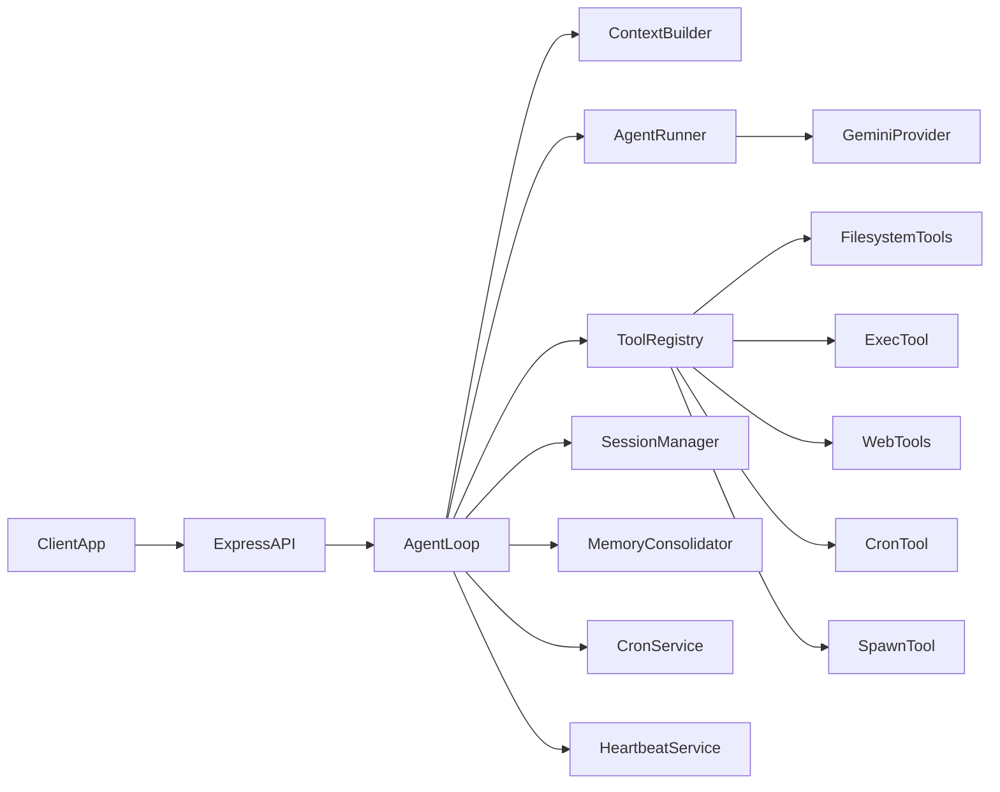

# FomoAgent Technical Guide

`fomoagent` is an API-first agent runtime (JavaScript/Node.js) inspired by `nanobot`, focused on tool-calling workflows without channel adapters (Telegram/Slack/Discord).

## Current MVP Mode (Web3 Concierge)

The runtime is currently configured for a narrow MVP:
- Event discovery (hackathons, conferences, Web3 meetups)
- Manual alpha monitor (only when user explicitly asks)

Out of scope for this MVP phase:
- KOL scouting
- ecosystem competitor monitor
- autonomous alpha scheduling via cron/heartbeat

### Response Contract (Always)

Every concierge response should contain:
1. A short human-readable digest
2. A structured JSON object

Expected JSON shape:

```json
{
  "query": "string",
  "generatedAt": "ISO-8601 string",
  "events": [
    {
      "name": "string",
      "startDate": "YYYY-MM-DD or null",
      "endDate": "YYYY-MM-DD or null",
      "city": "string or null",
      "country": "string or null",
      "chainOrEcosystem": "string or null",
      "eventType": "string or null",
      "sourceUrl": "https://...",
      "whyRelevant": "string",
      "signalTags": ["string"],
      "confidence": "low|medium|high"
    }
  ],
  "alphaSignals": [
    {
      "signalType": "announcement|registration|sponsor",
      "entity": "string",
      "change": "string",
      "significance": "low|medium|high",
      "evidenceUrl": "https://..."
    }
  ]
}
```

### Manual MVP Test Prompts

- `Find Web3 hackathons in India in next 2 months`
- `Find events relevant to Solana builders this month`
- `Run alpha monitor now for event sponsor activity`

## Current Scope (Gemini-Only Build)

- Single LLM provider: `gemini` only.
- Gemini is called through the OpenAI-compatible endpoint.
- OpenClaw Gemini hardening is ported into `src/providers/gemini.js`:
  - base URL normalization
  - tool schema sanitization for Gemini-incompatible JSON schema keywords
  - turn-order fix (first non-system turn cannot be assistant)
- No MCP integration in runtime/tools.

## What This Agent Can Do

- Run LLM-driven multi-step tool loops with retries and streaming.
- Persist sessions to disk and maintain long-term memory (`MEMORY.md`, `HISTORY.md`) with automatic consolidation.
- Load skills from workspace `skills/*/SKILL.md` and inject them into system context.
- Execute file tools, shell commands, web search/fetch, scheduling, and background spawning.
- Run recurring jobs via a persistent cron service (`cron/jobs.json`).
- Run proactive periodic heartbeat checks from `HEARTBEAT.md`.
- Expose API endpoints for chat, status, run lifecycle, cron operations, and heartbeat inspection.

## What It Does Not Include

- No channel framework (no Telegram/Slack/Discord adapters).
- No MCP tooling/transport in this codebase.
- No multi-provider routing (Gemini-only by design).

## High-Level Architecture



## End-to-End User Flow

1. Client sends a request to `POST /v1/chat` (or `/v1/chat/stream`).
2. API forwards the request to `AgentLoop.process()`.
3. `AgentLoop` loads session history, runtime context, memory, bootstrap docs, and skill summaries.
4. `AgentRunner` calls `GeminiProvider` with sanitized tool schemas.
5. If model asks for tools, `ToolRegistry` executes tool calls and feeds tool results back to the model.
6. Loop repeats until final answer or stop condition (`completed`, `max_iterations`, `cancelled`, `error`).
7. Turn is persisted to session JSONL; memory consolidation may run in background.
8. Response is returned to API client; streaming mode emits deltas and progress events.

## How To Connect and Run

### 1) Install

```bash
cd /Users/soumalyapaul/Documents/Projects/tinyfish2
npm install
```

### 2) Configure

- Copy `.env.example` to `.env` and set:
  - `GEMINI_API_KEY` (required)
  - `TINYFISH_API_KEY` (required for TinyFish event scraping)
- Optional search keys: `BRAVE_API_KEY`, `TAVILY_API_KEY`, `EXA_API_KEY`, `PERPLEXITY_API_KEY`

- Default config path: `~/.fomoagent/config.json` (or use env override)
- Override config path with: `FOMOAGENT_CONFIG_PATH=/absolute/path/config.json`
- Env vars are loaded from root `.env`.

Minimal config:

```json
{
  "agents": {
    "defaults": {
      "workspace": "~/.fomoagent/workspace",
      "model": "gemini/gemini-2.0-flash",
      "provider": "gemini"
    }
  },
  "providers": {
    "gemini": {
      "apiKey": "${GEMINI_API_KEY}",
      "apiBase": null
    }
  }
}
```

### 3) Start server

```bash
npm run agent:dev
# or
npm run agent
```

Server binds to `gateway.host` + `gateway.port` from config.

### 4) Start interactive CLI (new)

```bash
npm run cli
```

CLI commands:
- `:help`
- `:session <id>`
- `:new`
- `:status`
- `:exit`

### 5) Send a request (direct API)

```bash
curl -X POST http://localhost:18790/v1/chat \
  -H "Content-Type: application/json" \
  -d '{"sessionId":"api:demo","message":"Find Web3 events next month"}'
```

### 6) Streaming request

```bash
curl -N -X POST http://localhost:18790/v1/chat/stream \
  -H "Content-Type: application/json" \
  -d '{"sessionId":"api:demo","message":"Research top Solana hackathons"}'
```

### Gemini rate limits (HTTP 429)

If you see `LLM transient error ... 429` in the server logs, Google is **rate-limiting** or your **quota** is exhausted for the Generative Language API.

- Wait 1–2 minutes between heavy test runs.
- Confirm billing and quotas in [Google AI Studio](https://aistudio.google.com/) / [Google Cloud console](https://console.cloud.google.com/) for the Generative Language API.
- Try a cheaper model in `~/.fomoagent/config.json` (for example `gemini/gemini-2.0-flash` vs larger models) if you hit daily limits.
- Optional: increase backoff in config under `retries.delaysMs` (defaults are already longer for 429s).

## API Surface

- `GET /health` - service health.
- `GET /v1/status?session=...` - runtime/session status snapshot.
- `GET /v1/sessions` - list persisted sessions.
- `POST /v1/sessions/new` - reset/archive a session.
- `POST /v1/chat` - standard chat completion.
- `POST /v1/chat/stream` - SSE streaming completion.
- `GET /v1/runs` - list background runs.
- `POST /v1/runs/cancel` - cancel active run by `runId`.
- `GET /v1/cron/jobs` - list cron jobs.
- `POST /v1/cron/jobs/:id/run` - execute a cron job immediately.
- `POST /v1/cron/jobs/:id/enable` - enable a cron job.
- `POST /v1/cron/jobs/:id/disable` - disable a cron job.
- `GET /v1/heartbeat/status` - heartbeat decisions/recent runs.

## Config Model (Important Sections)

- `agents.defaults`: model defaults, temperature, iteration limit, run timeout, timezone.
- `providers.gemini`: Gemini credentials/endpoint.
- `gateway`: API bind host/port.
- `runtime`: concurrency cap (`maxConcurrentRuns`).
- `tools`: web + exec behavior, workspace restriction.
- `scheduler`: cron service behavior and persistence limits.
- `heartbeat`: periodic proactive execution policy.
- `retries`: provider retry delays in milliseconds.

## Web Search Support

`web_search` supports:

- `brave` (`BRAVE_API_KEY`)
- `tavily` (`TAVILY_API_KEY`)
- `exa` (`EXA_API_KEY`)
- `perplexity` (`PERPLEXITY_API_KEY`)
- `duckduckgo` (keyless fallback)

If `tools.web.search.provider` is `auto`, provider selection priority is:
`brave` -> `tavily` -> `exa` -> `perplexity` -> `duckduckgo`.

## Runtime Data Written By Agent

Under configured workspace:

- `memory/MEMORY.md` - long-term summary memory.
- `memory/HISTORY.md` - append-only historical events.
- `sessions/*.jsonl` - session message logs + metadata.
- `cron/jobs.json` - persisted recurring job definitions/history.
- `skills/*/SKILL.md` - user/workspace custom skill instructions.
- `HEARTBEAT.md` - source for proactive periodic checks.

## Folder-by-Folder + File-by-File One-Liners

### Root (`tinyfish2/`)

- `README.md` - technical guide and run instructions.
- `package.json` - single package manifest for root + fomoagent runtime.
- `cli.js` - interactive terminal client that talks to fomoagent API.
- `.env.example` - required and optional API key template.

### `fomoagent/src/`

- `fomoagent/src/server.js` - runtime bootstrap entrypoint (config/provider/cron/heartbeat/api startup).
- `fomoagent/src/index.js` - core intelligence module definitions injected into prompt.

### `fomoagent/src/api/`

- `fomoagent/src/api/server.js` - Express route definitions for chat, streaming, status, sessions, runs, cron, and heartbeat.

### `fomoagent/src/agent/`

- `src/agent/context.js` - system prompt/context assembly using bootstrap files, memory, skills, and runtime metadata.
- `src/agent/loop.js` - main orchestration layer for request processing, tool registration, persistence, cancellation, and background runs.
- `src/agent/runner.js` - iterative LLM/tool execution loop with streaming and stop-reason handling.
- `src/agent/memory.js` - memory store + token-aware consolidation logic and archival fallback behavior.
- `src/agent/skills.js` - workspace skills discovery, frontmatter parsing, and skill summary rendering.

### `fomoagent/src/config/`

- `src/config/schema.js` - default configuration object and Gemini provider spec.
- `src/config/loader.js` - config file loading/merging, env interpolation/hydration, provider matching, and validation.

### `fomoagent/src/providers/`

- `src/providers/base.js` - provider abstraction types and retry wrappers.
- `src/providers/gemini.js` - Gemini provider (OpenAI-compat) with OpenClaw hardening safeguards.
- `src/providers/registry.js` - provider factory that resolves and instantiates Gemini.

### `fomoagent/src/tools/`

- `src/tools/base.js` - base `Tool` contract and schema conversion helper.
- `src/tools/registry.js` - runtime tool registry with execution and standardized error hinting.
- `src/tools/filesystem.js` - read/write/edit/list directory tools with optional workspace boundary enforcement.
- `src/tools/shell.js` - guarded shell execution tool with deny-pattern and timeout controls.
- `src/tools/web.js` - web search and URL fetch/extract tools with SSRF checks and untrusted content labeling.
- `src/tools/message.js` - message callback tool for intermediate status delivery.
- `src/tools/cron.js` - tool interface for creating/listing/enabling/disabling/running cron jobs.
- `src/tools/spawn.js` - tool interface for launching/listing independent background runs.

### `fomoagent/src/cron/`

- `src/cron/store.js` - JSON persistence for cron jobs.
- `src/cron/service.js` - recurring job scheduler, execution lifecycle, and run history tracking.

### `fomoagent/src/heartbeat/`

- `src/heartbeat/service.js` - periodic proactive runner driven by `HEARTBEAT.md` with rate limiting and run logs.

### `fomoagent/src/security/`

- `src/security/network.js` - URL/IP safety checks used for SSRF prevention and internal URL blocking.

### `fomoagent/src/session/`

- `src/session/manager.js` - session object model and JSONL persistence/recovery utilities.

### `fomoagent/src/utils/`

- `src/utils/helpers.js` - generic helpers for directories, token estimation, message shaping, and text cleanup.

### `fomoagent/test/`

- `test/config.test.js` - validates config schema and config validation failures.
- `test/cron.test.js` - validates cron service lifecycle basics (create/list/disable + persistence path).

## Capability Mapping (API Runtime, No Channels)

- `Core loop parity`: implemented.
- `Tool registry parity`: implemented.
- `Memory/session parity`: implemented.
- `Skills parity`: implemented.
- `Cron parity`: mostly implemented for API runtime use.
- `Heartbeat parity`: implemented for proactive periodic execution.
- `Spawn/background parity`: implemented.
- `Web search parity target`: expanded with Brave/Tavily/Exa/Perplexity/DDG.
- `Provider scope`: Gemini-only.
- `Channel parity`: intentionally out of scope.

## Suggested Next Improvements

- Add richer tests for Gemini edge cases (tool schema transformations, turn-order replay, custom apiBase variants).
- Add richer tests for streaming, cancellation races, and heartbeat decision quality.
- Add OpenAPI spec for API routes and payload contracts.
- Add structured metrics/logging for production observability.

## Subagent Spawn Support

`fomoagent` can spawn background agent runs using the `spawn` tool.

Current behavior:

- Starts an independent background run with its own `sessionId` and prompt.
- Tracks run metadata (`runId`, status, timestamps, failure reason if any).
- Exposes run inspection via `GET /v1/runs`.

Current limitations:

- Spawned runs execute inside the same runtime process (not isolated worker processes by default).
- No dedicated per-subagent persona/model/tool profile orchestration out of the box.
- It is parallel background execution, not yet full multi-agent orchestration.
